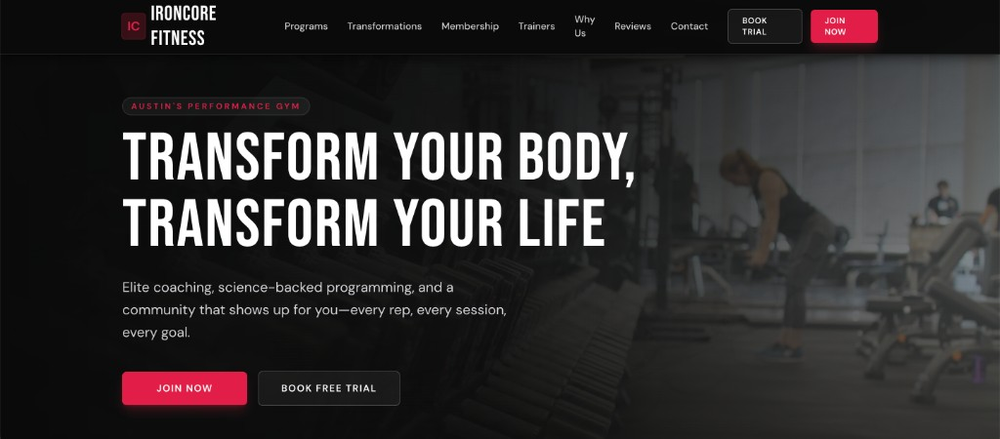
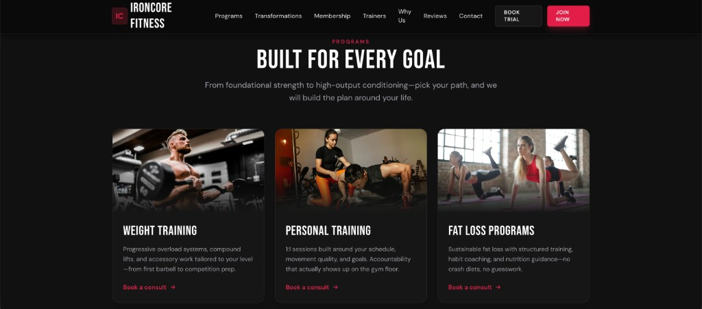
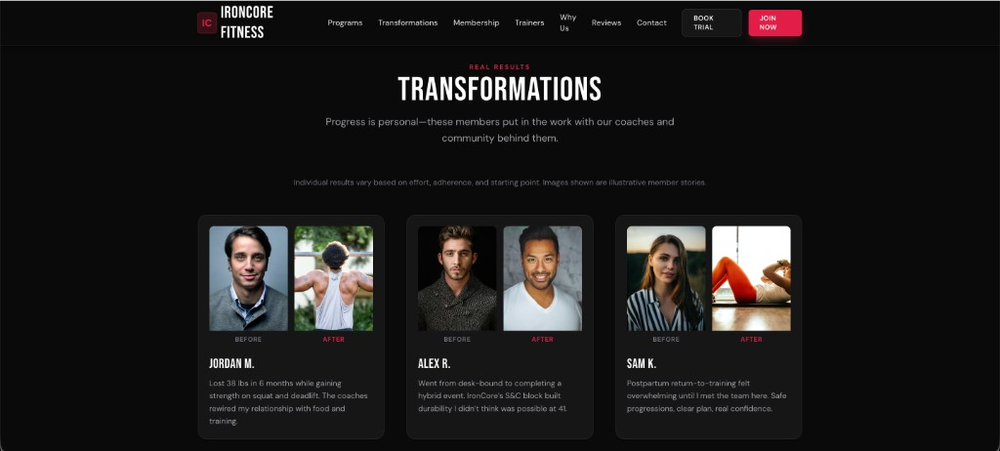

# IronCore Fitness — Gym & Fitness Trainer Website

A production-style marketing site for **IronCore Fitness** (Austin’s performance gym): dark, high-contrast UI, sticky navigation, and content-driven sections for programs, member transformations, membership, trainers, social proof, and contact.

**Tagline:** Train Harder. Live Stronger.

---

## Live demo

**[https://fitnesstrainers.vercel.app/](https://fitnesstrainers.vercel.app/)**

Open the demo for the full scroll experience, CTAs, and responsive layout.

---

## Demo walkthrough (video)

Screen capture of the site in the browser (with controls):

<video src="docs/media/demo.webm" controls playsinline width="100%" style="max-width: 960px; border-radius: 12px;">
  <p>Your browser does not support embedded WebM video. <a href="docs/media/demo.webm">Download or open <code>docs/media/demo.webm</code></a> locally.</p>
</video>

**Original capture path (local):** `/Users/abhishek/Downloads/screen-capture.webm` — the same file is included in the repo as `docs/media/demo.webm` so clones and GitHub renders stay self-contained.

---

## Screenshots

| Hero | Programs |
| :---: | :---: |
|  |  |

| Transformations |
| :---: |
|  |

---

## Highlights

- **Sticky header** with logo, anchor navigation, and primary / secondary CTAs (`BOOK TRIAL`, `JOIN NOW`).
- **Hero** with location pill, headline, supporting copy, and dual CTAs over a cinematic gym visual (with optional background video in content data).
- **Programs** — card grid with imagery, descriptions, and “Book a consult” style links.
- **Transformations** — before/after layout with member names and short success stories (disclaimer-friendly copy).
- **Membership**, **Trainers**, **Why Us**, **Reviews**, **CTA banner**, and **Contact** sections on a single scroll narrative.
- **Accessibility** — skip link to main content; focus-visible styles on interactive elements.
- **Content as data** — copy, nav labels, and media URLs live in `src/data/siteContent.ts` for easy swaps without restructuring components.

---

## Tech stack

| Layer | Choice |
| --- | --- |
| UI | [React](https://react.dev/) 19 |
| Language | [TypeScript](https://www.typescriptlang.org/) |
| Build & dev | [Vite](https://vite.dev/) 8 |
| Styling | [Tailwind CSS](https://tailwindcss.com/) 4 (via `@tailwindcss/vite`) |

---

## Getting started

**Requirements:** Node.js 20+ recommended (matches current Vite / toolchain expectations).

```bash
npm install
npm run dev
```

Then open the URL Vite prints (typically `http://localhost:5173`).

| Script | Purpose |
| --- | --- |
| `npm run dev` | Start dev server with HMR |
| `npm run build` | Typecheck + production build to `dist/` |
| `npm run preview` | Preview the production build locally |
| `npm run lint` | Run ESLint |

---

## Project structure (overview)

```
src/
  App.tsx                 # Page composition & skip link
  components/             # Section + UI components (Hero, Programs, …)
  data/siteContent.ts     # Brand, nav, copy, image/video URLs
  index.css               # Global styles / Tailwind entry
docs/
  media/                  # README assets: screenshots + demo.webm
```

---

## Deployment

The live demo is hosted on **Vercel**. For your own fork: connect the repo in the Vercel dashboard, use the default Vite settings, set the build command to `npm run build` and output directory to `dist`.

---

## Media in this repo

| File | Description |
| --- | --- |
| `docs/media/hero.png` | Hero / above-the-fold |
| `docs/media/programs.png` | Programs grid |
| `docs/media/transformations.png` | Real results / transformations |
| `docs/media/demo.webm` | Full-page screen capture walkthrough |

---

Built as a focused **React + TypeScript + Vite** front end — suitable as a portfolio piece, gym landing template, or starting point for CMS or booking integrations.
